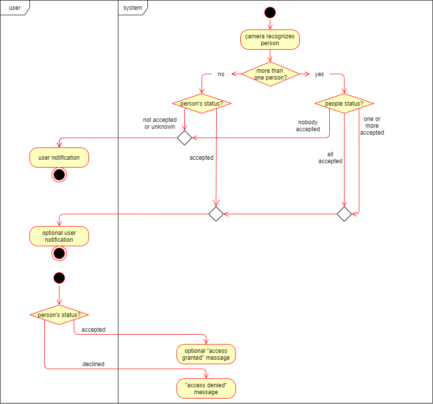

# Use-Case Specification: Guest Visits

# 1. Guest Visits

## 1.1 Brief Description
When somebody enters your property and the camera detects this person or group a notification should be sent to the user. Depending on the current category of those people the notification can be optional. Since the user has the possibilty to accept or decline the access/stay of the visitors a message has to be invoked to inform them of the made choice.

## 1.2 Mockup
--

## 1.3 Screenshot

# 2. Flow of Events
--

## 2.1 Basic Flow

### Activity Diagram

### .feature File
Our testing file using Cucumber can be found
[here.](https://github.com/mymanu/Camera-Observation-Tool/blob/main/.feature_files/Guest_Visits.feature)

## 2.2 Alternative Flows
--

# 3. Special Requirements
--

# 4. Preconditions
No special preconditions.
Just the camera, as well as server and client application have to be running and connected to each other.

# 5. Postconditions
Connected to "guest visits home" event:
The server has to handle the video material in a certain time frame before and after visitor detection.

# 6. Function Points
--
