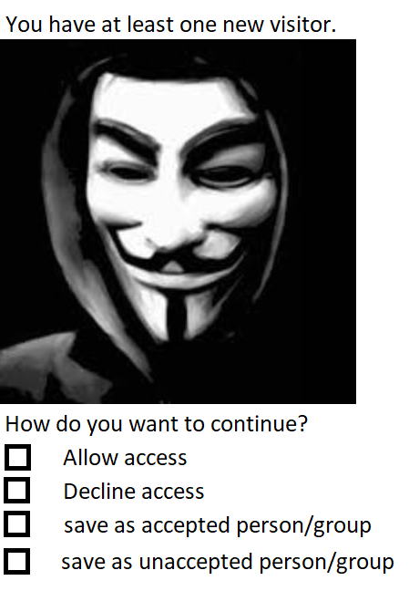

# Use-Case Specification: Guest Visits

# 1. Guest Visits

## 1.1 Brief Description

## 1.2 Mockup
--

## 1.3 Screenshot

# 2. Flow of Events
--

## 2.1 Basic Flow
--

### Activity Diagram

### .feature File
Our testing file using Cucumber can be found
[here.](https://github.com/mymanu/Camera-Observation-Tool/blob/main/.feature_files/Guest_Visits.feature)

## 2.2 Alternative Flows
--

# 3. Special Requirements
--

# 4. Preconditions
--

# 5. Postconditions
--

# 6. Function Points
--
