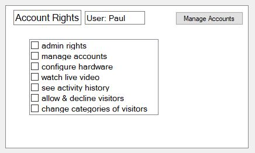
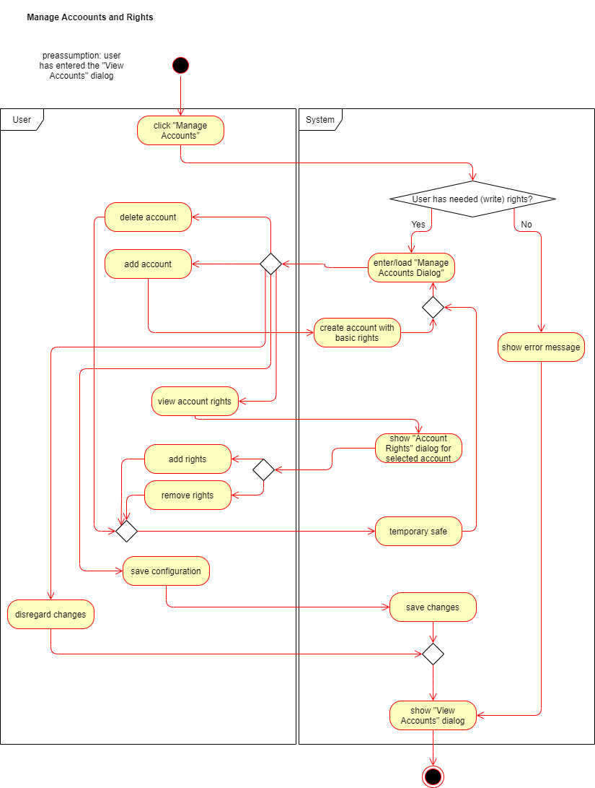

# Use-Case Specification: Manage Accounts and Rights

# 1. Manage Accounts and Rights

## 1.1 Brief Description
With this CRUD function the user is able to create and delete accounts if he or she has the needed rights. Furthermore the user can configure the rights of other users depending on the authority level of his account.

## 1.2 Mockup
--

## 1.3 Screenshot

# 2. Flow of Events
--

## 2.1 Basic Flow

### Activity Diagram

### .feature File
--

## 2.2 Alternative Flows
--

# 3. Special Requirements
--

# 4. Preconditions
The user has entered the "View Accounts" dialog.

# 5. Postconditions
The user has entered the "View Accounts" dialog.

# 6. Function Points
--
